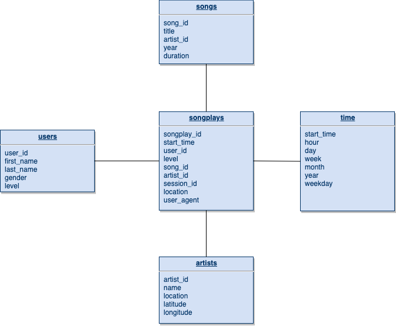

# Project: Data Modeling with Postgres

## Introduction

A startup called Sparkify wants to analyze the data they've been collecting on songs and user activity on their new music streaming app. The analytics team is particularly interested in understanding what songs users are listening to. Currently, they don't have an easy way to query their data, which resides in a directory of JSON logs on user activity on the app, as well as a directory with JSON metadata on the songs in their app.

They'd like a data engineer to create a Postgres database with tables designed to optimize queries on song play analysis, and bring you on the project. Your role is to create a database schema and ETL pipeline for this analysis. You'll be able to test your database and ETL pipeline by running queries given to you by the analytics team from Sparkify and compare your results with their expected results.

## Project Description

In this project, you'll apply what you've learned on data modeling with Postgres and build an ETL pipeline using Python. To complete the project, you will need to define fact and dimension tables for a star schema for a particular analytic focus, and write an ETL pipeline that transfers data from files in two local directories into these tables in Postgres using Python and SQL.

### Discuss the purpose of this database in the context of the startup, Sparkify, and their analytical goals.

The analytics team is interested in understanding the songs that the users are listening.

### State and justify your database schema design and ETL pipeline.
The database uses the star schema with the Fact table songplays and Dimension tables users, songs, artists and time. This allows the database to be denormalized, simplifies queries and allows fast aggregations of data. All dimension tables have the Primary Key set to a unique value in the tables to ensure no duplicates are found in the tables.

#### Database schema diagram

The ETL pipeline populates all Dimension tables first so any reference data required by the Fact table will be ready for querying when its population begins. When populating Dimension tables it makes use of the Pandas dataframe feature to drop duplicates from the table. The pipeline reads from the song_data data source to obtain data about the songs and artists dimension tables. And the log_data data source to obtain data for the songplays fact table referencing the artist and songs dimension tables to obtain the artist and song ids. The same log data is also used time and users dimension tables

### Provide example queries and results for song play analysis.

This database allows Sparkify to analyzed the data in the following ways
1. Number of free or paid users listening to songs
   SELECT s.title, sp.level, count(sp.*) numOfUsers FROM songplays sp JOIN songs s ON sp.song_id = s.song_id
   GROUP BY s.title, sp.level
2. Number of users listening to songs by period
   SELECT s.title, t.year || '-' || t.month period, count(sp.*) numOfUsers FROM songplays sp JOIN songs s ON sp.song_id = s.song_id JOIN time t on t.start_time = sp.start_time GROUP BY s.title, t.year || '-' || t.month

This is a non comprehensive list and there are more ways to analyzed these data. One interesting observation working with the sample data was the low number of songs matching the log data. This actually resulted in only one songplays entry finding the equivalent song and also the artist. Looking into the raw data, it appears that the dataset for song_data logs appears to be very small compared to the songs found in the log_data logs.